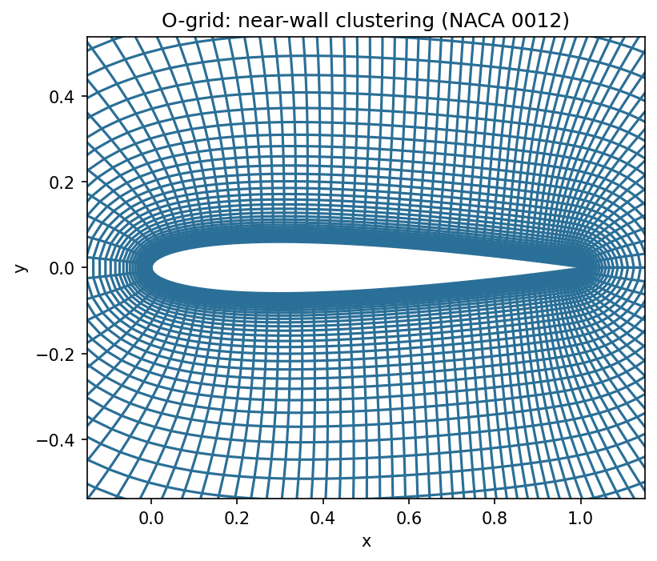
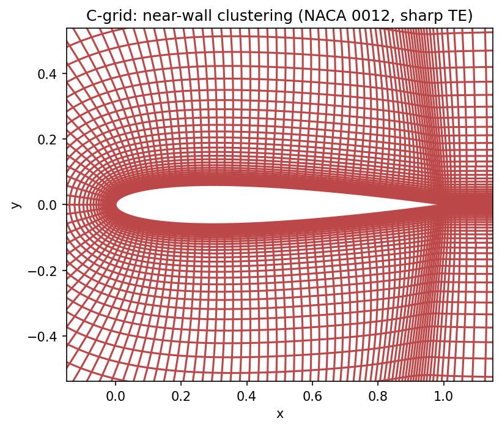
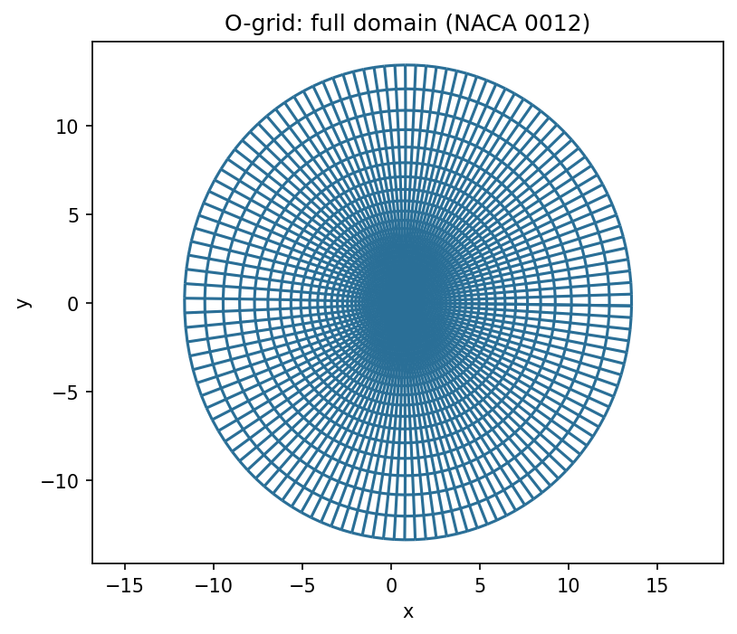
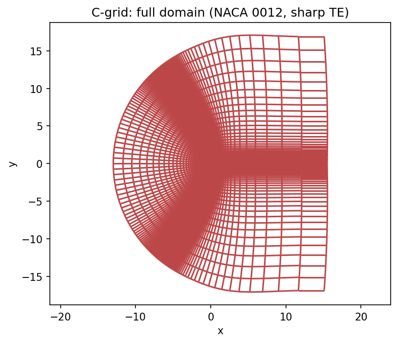

# Construct2D

*A structured 2D grid generator for airfoils — hyperbolic or elliptic,
O-grid or C-grid.*

<table>
<tr>
<td></td>
<td></td>
</tr>
<tr>
<td align="center">O-grid</td>
<td align="center">C-grid (wake-cut)</td>
</tr>
</table>

This is a vendored copy of [Construct2D](https://sourceforge.net/projects/construct2d/)
(Daniel Prosser, GPLv3) — see the top-level [Credits](../README.md#credits)
for full attribution. It's the first stage of every `Construct2D_to_<SOLVER>/`
pipeline in this repo: given an airfoil coordinate file, it produces the 2D
`.p3d`/`.nmf` mesh pair that everything downstream builds on.

**This directory is distributed exactly as upstream Construct2D ships it** —
source, `Makefile`s, `doc/`, `sample_airfoils/`, and license — with one
addition: `generate_grid_previews.py`, used to make the images on this page.
The original upstream `README` (plain text) is kept alongside this one
unmodified; this file is just a friendlier front door for browsing the repo.

## Building

```bash
cp Makefile_Linux_MacOSX Makefile   # or Makefile_Windows on Windows
make
```

See `INSTALL` and `doc/user_manual.pdf` for full build and usage details.

## Full-domain view

<table>
<tr>
<td></td>
<td></td>
</tr>
</table>

## Regenerating these images

The grid pictures above come straight from `postpycess.py` — Construct2D's
own included CFD postprocessor (also vendored unmodified, plus a Python 3
port) — via its `read_grid()`/`plot_grid()` functions:

```bash
python3 generate_grid_previews.py
```

`postpycess.py` itself is also usable interactively for exploring a grid
(`python3 postpycess.py`), including contour and airfoil-surface plots of
any Plot3D function file, not just plain grid geometry.
