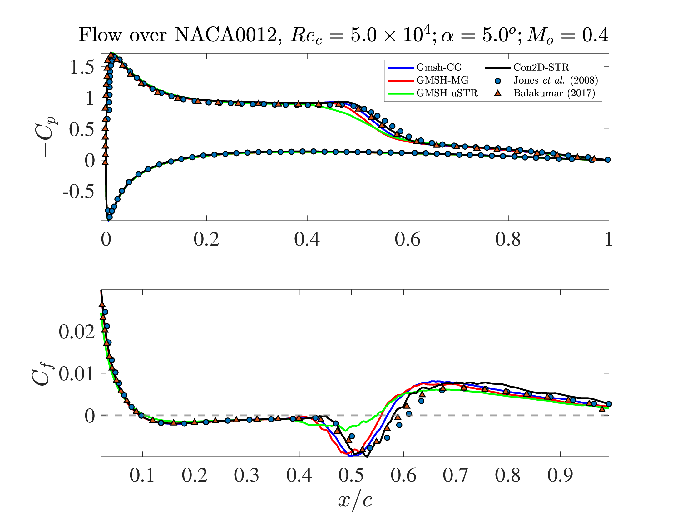

# Construct2D → SOD2D

This is the **middle and final stage** of the pipeline described in the
[top-level README](../README.md). Construct2D gives you a 2D grid — a
cross-section of an airfoil, described by a grid of points. This pipeline
turns that 2D grid into the kind of mesh SOD2D actually needs: a real,
partitioned 3D mesh, with a smooth (not jagged) airfoil surface, ready to
run a production airflow simulation on.

## The big picture

If you're new to this, here's the problem in plain terms before any tool
names come up:

1. **You have a 2D shape.** Construct2D's output (a `.p3d` file) is just a
   grid of points tracing the airfoil's cross-section and the empty space
   around it, out to some far boundary.
2. **SOD2D needs a 3D mesh.** A real wing has span (length), so the 3D
   mesh is built by copying that 2D cross-section along a straight line —
   "extruding" it — and telling the solver the flow repeats identically
   at every cross-section (**spanwise-periodic**; a standard simplification
   for studying a 2D airfoil shape in a 3D solver, valid as long as you're
   not modeling wingtip effects).
3. **SOD2D runs in parallel, across many processes at once**, each one
   handling a piece of the mesh — so before it can run, the mesh has to be
   cut up ("partitioned") into that many pieces.
4. **The airfoil surface starts out jagged, not smooth.** The grid points
   from Construct2D only approximate the true, smooth airfoil curve, and
   the extra points the high-order mesh format adds between them get
   placed by simple straight-line interpolation by default — turning a
   *curved* surface into a series of tiny flat facets. Before running a
   real simulation, this pipeline bends those points back onto the true
   smooth curve: it fits a **spline** (a smooth curve threaded through a
   handful of points) through the wall's own corner points, then lets
   SOD2D's own elasticity solver pull every mesh node near the wall onto
   that curve while relaxing the rest of the mesh to match, so nothing
   folds over or collapses.
5. **Two grid shapes are supported: O-grid and C-grid.** Picture the
   airfoil from above. An **O-grid** wraps the mesh all the way around
   the airfoil in complete rings, like concentric circles — it closes
   perfectly on itself. A **C-grid** instead follows the airfoil surface
   and then peels off downstream in a wake region, so from above it looks
   like the letter C — better suited to resolving the wake behind the
   airfoil. Both are handled by the same scripts here; see
   [`linear_mesh/README.md`](linear_mesh/README.md) for exactly what
   differs between them.

Once you have that picture, the two stages below are just: *build,
partition, and smooth the mesh*, then *run it*.

```
2D grid from Construct2D  ──►  linear_mesh/        ──►  high_order_mesh/  ──►  copy the smoothed
   (.p3d + .nmf files)         extrude to 3D,           smooth the wall         mesh out and run
                                convert, partition       boundary                 production
```

## Stages

1. **[`linear_mesh/`](linear_mesh/README.md)** — extrudes the 2D mesh
   spanwise into 3D, remaps the Neutral Map File onto the extruded block,
   converts it to Gmsh format with wall/inlet/outlet boundary
   classification, exports it to SOD2D's own HDF5 mesh format, and
   partitions it for parallel runs. `run_pipeline.py` orchestrates all of
   this, for one airfoil, in a single command.
2. **[`high_order_mesh/`](high_order_mesh/README.md)** — snaps every wall
   node from step 1 onto a smooth curve fit through the wall's own corner
   points, and elastically relaxes the rest of the mesh to match, using
   SOD2D's own `MeshElasticitySolver`. There's no separate
   production-run stage in this repo — copy the smoothed mesh this step
   writes out wherever you actually want to run your simulation.

## `CFD_solvers/sod2d_gitlab/`

[SOD2D](https://gitlab.com/bsc_sod2d/sod2d_gitlab) itself — an external
codebase this pipeline depends on but doesn't own, included as a git
submodule at the repo root's [`CFD_solvers/`](../CFD_solvers) (shared
with `etaGrid_to_SOD2D/` and `pyHyp_to_SOD2D/`, which also build against
this same copy — see the top-level README's
[Credits](../README.md#credits)). It's currently pinned to the
`277-witness-points-using-wrong-connectivity` branch, which carries the
parametric arc-length wall-smoothing placement described above. Both
stages above depend on tools/binaries built from it:

| Binary | Used by | Build notes |
|---|---|---|
| `sod2d_gitlab/utils/gmsh2sod2d/gmsh2sod2d.py` | `linear_mesh/` (SOD2D export step) | plain script, copy into `linear_mesh/sod2d_tools/` |
| `sod2d_gitlab/tool_meshConversorPar` | `linear_mesh/` (partitioning step) | CPU-only, `-DTOOL_MESHPART=ON` at CMake configure time |
| `sod2d_gitlab`'s `sod2d` app (`MeshElasticitySolver` case) | `high_order_mesh/` | GPU build (`build_gpu`), see `high_order_mesh/airfoil0.sh` |

See `sod2d_gitlab`'s own [README](../CFD_solvers/sod2d_gitlab/README.md)
for full build instructions.

## Prerequisites

- Python 3 with `numpy` (and `h5py` for the SOD2D export step).
- [Gmsh](https://gmsh.info/), invoked as a CLI.
- MPI and HDF5, for mesh partitioning and running SOD2D.
- SOD2D itself, built from the `sod2d_gitlab` submodule — see
  [`CFD_solvers/sod2d_gitlab/`](#cfd_solverssod2d_gitlab) above.

**No mesh, results, or log files are stored in this repo** (`*.hdf`,
`*.h5`, `*.msh`, `*.log`, etc.) — they're all excluded on purpose.
Regenerate them by running the pipeline below rather than expecting them
to already be there after a clone.

## Running it end to end

```bash
# 1. Generate the 2D grid with Construct2D itself (a separate tool, not
#    part of this repo) -> {airfoil}.p3d, {airfoil}.nmf

# 2. linear_mesh/: extrude to 3D, convert, partition -- see
#    linear_mesh/README.md for what each of these does and why
cd linear_mesh
python3 run_pipeline.py \
    --work-dir runs/env_0 \
    --config flow_config_ogrd.json \
    --airfoil-file airfoil

# 3. high_order_mesh/: copy the mesh + wall spline table from step 2,
#    then smooth the wall boundary -- see high_order_mesh/README.md
cp runs/env_0/*.hdf runs/env_0/*_wall_spline.dat ../high_order_mesh/
cd ../high_order_mesh
sbatch airfoil0.sh

# 4. Copy the resulting smoothed mesh (mesh_h5_file_newname in
#    MeshElasticitySolver.json) wherever you want to run production.
```

## Validation

A production SOD2D run through this pipeline (`Con2D-STR` below — a
Construct2D-generated, structured grid, smoothed and partitioned as
described above) was compared against flow over a NACA0012 airfoil at
`Re_c = 5.0×10^4`, `α = 5.0°`, `M_∞ = 0.4` — a case with a laminar
separation bubble on the suction side, a sensitive test of both mesh and
solver accuracy:



Spanwise-averaged surface pressure (`-C_p`) and skin friction (`C_f`)
along the chord agree closely with the reference DNS
(Jones, Sandberg & Sandham 2008) and a second reference solution
(Balakumar 2017), including the separation bubble itself — the region
of negative `C_f` around `x/c ≈ 0.45–0.6` where the boundary layer
separates, transitions, and reattaches. `Gmsh-CG`, `GMSH-MG`, and
`GMSH-uSTR` are additional comparison meshes/solutions included
alongside `Con2D-STR` in the same study, not generated by this repo.

- L. E. Jones, R. D. Sandberg, N. D. Sandham, "Direct numerical
  simulations of forced and unforced separation bubbles on an airfoil
  at incidence," *Journal of Fluid Mechanics*, vol. 602, pp. 175–207,
  2008. DOI: [10.1017/S0022112008000864](https://doi.org/10.1017/S0022112008000864)
- P. Balakumar, "Direct Numerical Simulation of Flows over an NACA-0012
  Airfoil at Low and Moderate Reynolds Numbers," AIAA Paper 2017-3978,
  47th AIAA Fluid Dynamics Conference, 2017.
  DOI: [10.2514/6.2017-3978](https://doi.org/10.2514/6.2017-3978)
